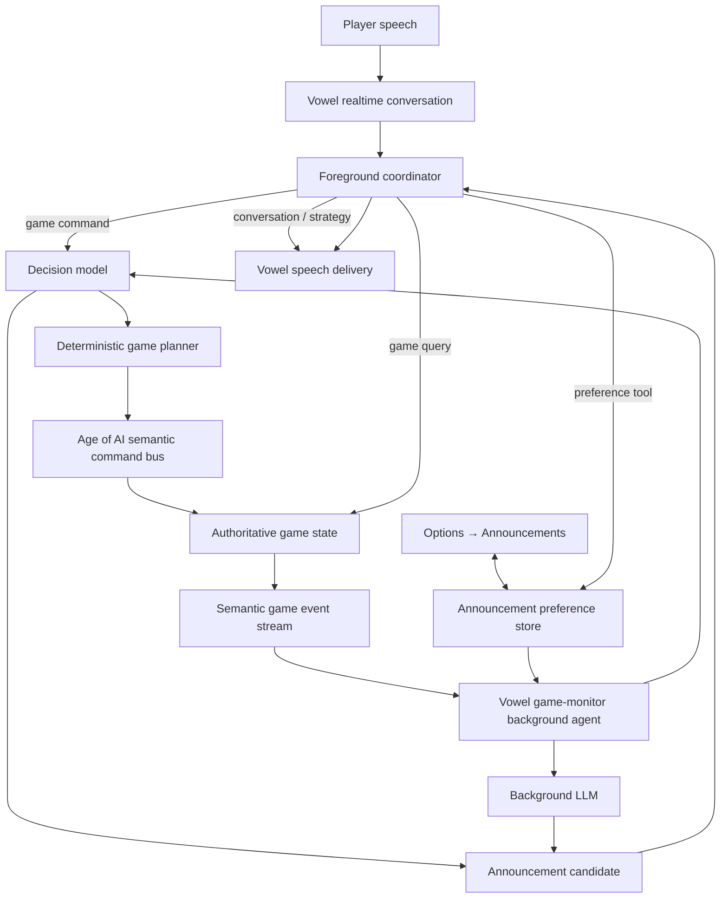

# Age of AI Conversational Voice & Announcement System Specification

**Project:** Age of AI × Vowel  
**Status:** Implementation Specification  
**Primary Goal:** Enable real-time conversational gameplay through Vowel, use a decision model for constrained game-command interpretation, and provide proactive game announcements through Vowel's background-agent system.  
**Audience:** Implementing agents and engineers working on the Age of AI fork and Vowel integration.

---

## 1. Purpose

This specification defines the integration between the forked **Age of AI** game and **Vowel** so that a player can:

- control the game through natural, real-time spoken conversation;
- ask questions about the current game state;
- receive context-aware spoken game notifications;
- receive higher-level strategic observations from Vowel's background LLM;
- control which announcement categories are active through a third **Announcements** tab in the existing game Settings modal;
- change those same announcement preferences conversationally.

The system must preserve clear boundaries between:

1. **Conversation orchestration** — Vowel.
2. **Decision interpretation** — the configured decision model exposed through the Vowel decision-model passthrough.
3. **Game truth and execution** — Age of AI's authoritative game state and command layer.
4. **Proactive game observation** — a Vowel background game-monitor agent.
5. **Player preferences** — a deterministic announcement preference store.

The integration must not rely on the voice model clicking or manipulating rendered game UI controls.

---

## 2. Existing Vowel Integration Assumptions

The Age of AI fork already embeds the Vowel popover and provides connection controls in the game's **Options → Vowel** tab.

The existing Vowel popover:

- runs inside the React application rather than in a separate iframe;
- owns one realtime conversational runtime;
- supports microphone input, typed input, client tools, attachments, playback, barge-in, cancellation, and live telemetry;
- executes client tools through the Vowel realtime session;
- supports a background coordinator and background agents;
- provides a decision-model passthrough suitable for constrained structured decisions.

The Age of AI integration should extend these existing seams rather than introduce a second voice runtime, second microphone path, or second conversational coordinator.

---

## 3. Scope

### 3.1 In Scope

This specification covers:

- spoken natural-language game commands;
- game-state queries;
- conversational references such as "that villager", "another one", "over there", and "build it here";
- a semantic game-command bridge;
- decision-model-based intent and command classification;
- confidence-based clarification;
- multi-action spoken requests;
- proactive game events and strategic observations;
- background game-monitor integration with Vowel;
- announcement filtering, prioritization, expiration, deduplication, cooldowns, and revalidation;
- player announcement preferences;
- an **Announcements** settings tab;
- conversational modification of announcement preferences;
- current/active announcement display;
- temporary muting;
- telemetry for decision and announcement behavior.

### 3.2 Out of Scope

The following are explicitly out of scope:

- visual UI automation for gameplay;
- DOM clicking as the primary means of game control;
- unrestricted model-generated code execution;
- replacing Age of AI's authoritative game-state or command system;
- replacing Vowel's coordinator with the decision model;
- making the background LLM directly control TTS;
- allowing a model to mutate announcement preferences without going through defined preference tools;
- persistent cross-account preference sync unless the game already has an appropriate player persistence layer.

### 3.3 Testing Prohibition

**Creating or running tests is prohibited for this implementation unless the user explicitly overrides this requirement.**

Implementing agents must not:

- create automated tests;
- create test suites;
- create test fixtures for testing purposes;
- add coverage work;
- add regression tests;
- add test-only mocks;
- run existing automated tests;
- run newly created tests;
- add test infrastructure as part of this work.

Implementation verification must be limited to normal development inspection and direct manual use of the feature. No automated test work is part of this specification.

---

## 4. Design Principles

### 4.1 Vowel Owns Conversation

Vowel remains responsible for:

- speech input;
- turn handling;
- barge-in;
- conversational context;
- response timing;
- deciding when speech should occur;
- coordinating foreground and background work.

The game integration must not create a parallel conversation engine.

### 4.2 The Decision Model Decides, It Does Not Execute

The decision model is used to interpret constrained choices such as:

- command vs query vs strategy discussion;
- command family;
- target resource;
- unit reference;
- building type;
- location reference;
- whether clarification is required;
- whether an event is worth announcing.

It must not:

- generate arbitrary executable JavaScript;
- directly mutate the game;
- bypass game validation;
- become the source of game truth.

### 4.3 The Game Is Authoritative

Age of AI remains authoritative over:

- units;
- buildings;
- resources;
- technologies;
- available actions;
- costs;
- command legality;
- placement legality;
- current age;
- player state;
- combat state;
- simulation results.

The voice system may request an action. The game decides whether that action is valid and performs it through existing game mechanisms.

### 4.4 Background Intelligence Must Be Quiet by Default

The game-monitor exists to surface useful information, not narrate the simulation.

Most low-value state changes must remain silent.

### 4.5 One Preference Store

The Announcements UI and conversational preference changes must write to the same deterministic preference store.

There must not be separate UI preferences and voice-only preferences.

---

## 5. High-Level Architecture



---

## 6. Conversational Gameplay

### 6.1 Supported Interaction Classes

The foreground Vowel coordinator must recognize four broad interaction classes:

```ts
type GameInteractionType =
  | "command"
  | "query"
  | "strategy"
  | "conversation"
```

Examples:

| Player utterance | Class |
|---|---|
| "Send two villagers to wood." | command |
| "How many idle villagers do I have?" | query |
| "Should I age up now?" | strategy |
| "That went badly." | conversation |

The coordinator may use the decision-model passthrough for a lightweight structured classification when needed.

---

## 7. Game Decision Layer

### 7.1 Decision Input

For actionable game turns, construct a compact decision state.

Example:

```ts
interface GameDecisionState {
  utterance: string

  game: {
    age: string
    resources: Record<string, number>
    population: {
      current: number
      capacity: number
    }
    selectedUnitIds: string[]
    selectedBuildingIds: string[]
    idleVillagerIds: string[]
    pointer?: {
      tile?: [number, number]
      world?: [number, number]
    }
    nearby?: {
      resourceNodes?: Array<{
        id: string
        kind: string
      }>
    }
    availableActions: GameAffordance[]
  }

  conversation: {
    lastCommand?: GameCommand
    lastReferencedUnitIds?: string[]
    lastReferencedBuildingId?: string
    lastReferencedLocation?: GameLocation
    pendingClarification?: PendingClarification
  }
}
```

Only state useful to the decision should be included.

The system must avoid sending large raw simulation snapshots when a compact semantic view is sufficient.

### 7.2 First-Level Decision

The first constrained decision determines interaction or command family.

Recommended command families:

```ts
type GameCommandFamily =
  | "gather"
  | "build"
  | "move"
  | "train"
  | "research"
  | "combat"
  | "economy"
  | "multi_action"
  | "none"
```

### 7.3 Command-Specific Decisions

Each command family should have a narrow decision schema.

Examples:

#### Gather

```ts
interface GatherDecision {
  resource: "food" | "wood" | "gold" | "stone"
  quantity?: number
  unitReference:
    | "selected"
    | "idle"
    | "previous"
    | "explicit"
  targetId?: string
}
```

#### Build

```ts
interface BuildDecision {
  buildingType: string
  builderReference:
    | "selected"
    | "idle"
    | "previous"
    | "automatic"
  placementReference:
    | "pointer"
    | "berries"
    | "woodline"
    | "town_center"
    | "selected_object"
    | "explicit"
    | "unspecified"
}
```

### 7.4 Dynamic Affordances

The game must provide currently legal or relevant affordances to the decision layer.

Example:

```ts
interface GameAffordance {
  id: string
  label: string
  category: string
  enabled: boolean
  cost?: Record<string, number>
  reasonUnavailable?: string
}
```

The decision model should choose among game-provided affordances whenever practical.

This prevents the decision layer from inventing commands unavailable in the current age or state.

---

## 8. Confidence and Clarification

A command must not execute merely because a model produced a syntactically valid answer.

The planner must inspect required decision confidence.

Recommended behavior:

```ts
if (decision.requiresClarification) {
  return requestClarification()
}

if (lowestRequiredConfidence < configuredThreshold) {
  return requestClarification()
}

return executeValidatedCommand()
```

Initial default threshold:

```ts
const GAME_COMMAND_CONFIDENCE_THRESHOLD = 0.70
```

This value must be configurable.

Examples:

- "Send the two idle villagers to wood."  
  High confidence. Execute immediately.

- "Move those guys over there."  
  If selected units or pointer location are ambiguous, ask for clarification.

---

## 9. Conversational References

Maintain lightweight session context for natural follow-up instructions.

```ts
interface GameConversationContext {
  lastReferencedUnitIds: string[]
  lastReferencedBuildingId?: string
  lastReferencedLocation?: GameLocation
  lastCommand?: GameCommand
  pendingCommand?: GameCommand
  pendingClarification?: {
    reason: string
    candidates: unknown[]
  }
}
```

This context supports utterances such as:

- "another one";
- "use that guy";
- "build it closer to the trees";
- "cancel that";
- "send them back";
- "do the same with gold".

The conversation context is advisory. Current game state remains authoritative.

---

## 10. Multi-Action Commands

The system must support utterances containing multiple actions.

Example:

> "Put two villagers on wood, one on berries, and build a house."

Recommended flow:

1. classify the utterance as `multi_action`;
2. split it into semantic clauses;
3. run each clause through the normal narrow decision flow;
4. produce an ordered deterministic plan;
5. validate each action against current game state;
6. execute actions using Age of AI's command system;
7. summarize the result conversationally.

Example internal representation:

```ts
interface GameActionPlan {
  actions: GameCommand[]
  sourceUtterance: string
}
```

The decision model must not generate an arbitrary executable program for a multi-action request.

---

## 11. Game Command Bridge

### 11.1 Semantic API

Expose semantic game operations to the Vowel integration.

Representative interface:

```ts
interface GameVoiceBridge {
  getContext(): Promise<GameVoiceContext>
  query(request: GameQuery): Promise<GameQueryResult>
  execute(command: GameCommand): Promise<GameCommandResult>
  updateAnnouncementPreferences(
    patch: AnnouncementPreferencePatch
  ): Promise<AnnouncementPreferences>
}
```

Underlying operations may include:

```ts
findUnits(...)
assignGatherers(...)
build(...)
move(...)
train(...)
research(...)
attack(...)
cancel(...)
```

These are implementation details behind the bridge.

### 11.2 Vowel Client Tools

Recommended public Vowel-facing tools:

```text
game_query
game_command
game_get_announcement_preferences
game_set_announcement_preference
game_mute_announcements
```

The Vowel coordinator should not need to know every primitive game command.

`game_command` should route through:

```text
decision model
    ↓
deterministic planner
    ↓
game validation
    ↓
Age of AI command execution
```

---

## 12. Proactive Game Announcements

### 12.1 Purpose

Vowel should be able to proactively speak useful game information without waiting for the player to ask.

Examples:

- "The barracks is finished."
- "You have two idle villagers."
- "You're one slot away from the population cap."
- "You can advance to the Bronze Age now."
- "Your research is complete."
- "Enemy units are approaching your woodline."

### 12.2 Event-Driven Source

Age of AI should emit semantic game events.

Representative events:

```ts
type GameEvent =
  | BuildingCompletedEvent
  | ResearchCompletedEvent
  | IdleVillagerStateEvent
  | PopulationStateEvent
  | ResourceStateEvent
  | AgeAvailableEvent
  | EnemySpottedEvent
  | UnderAttackEvent
```

Examples:

```ts
{
  type: "building.completed",
  buildingId: "barracks-12",
  buildingType: "barracks"
}
```

```ts
{
  type: "economy.idle_villagers",
  count: 2,
  unitIds: ["villager-4", "villager-7"]
}
```

The event stream should describe semantic game changes rather than rendering changes.

---

## 13. Vowel Game-Monitor Background Agent

### 13.1 Agent Definition

Create a dedicated Vowel background agent:

```ts
const gameMonitorAgent: BackgroundAgentDefinition = {
  id: "game-monitor",
  description:
    "Observes Age of AI state and reports important tactical, economic, and progression events.",
  run: context =>
    Effect.gen(function* () {
      // subscribe to semantic game events
      // maintain compact rolling state
      // apply player announcement preferences
      // classify candidate notifications
      // report useful notifications to the coordinator
    })
}
```

### 13.2 Lifetime

The game-monitor should be long-lived for the active Vowel/game session.

It should not spawn a completely unrelated worker for every small game event.

It may maintain lightweight rolling state including:

- recent candidate announcements;
- recently delivered announcements;
- current active conditions;
- player notification preferences;
- cooldown state;
- strategic observations already surfaced.

### 13.3 Responsibilities

The game-monitor is responsible for:

1. receiving semantic game events;
2. suppressing disabled categories;
3. applying deterministic event rules;
4. determining whether further decision/reasoning is needed;
5. using the decision model for relevance decisions when appropriate;
6. using the background LLM for contextual or strategic interpretation;
7. creating structured announcement candidates;
8. reporting candidates to the Vowel coordinator.

The game-monitor does **not** directly speak.

---

## 14. Notification Pipeline

```mermaid
flowchart LR
    Event[Game event]
    Pref[Preference gate]
    Rules[Deterministic rules]
    Decision[Decision model relevance]
    BG[Background LLM analysis]
    Candidate[Announcement candidate]
    Revalidate[Revalidate current state]
    Coordinator[Vowel coordinator]
    Speech[Speech]

    Event --> Pref
    Pref --> Rules
    Rules --> Decision
    Decision --> BG
    BG --> Candidate
    Candidate --> Revalidate
    Revalidate --> Coordinator
    Coordinator --> Speech
```



Not every event must use every stage.

Examples:

- `building.completed` may need no LLM reasoning.
- `age.available` may be deterministic.
- "You are floating wood and underproducing military units" may require background reasoning.
- "Should this minor event interrupt current speech?" is a coordinator decision.

---

## 15. Announcement Categories

Initial categories:

```ts
type AnnouncementCategory =
  | "building_complete"
  | "research_complete"
  | "age_available"
  | "idle_villagers"
  | "population"
  | "resource_shortage"
  | "resource_surplus"
  | "enemy_spotted"
  | "under_attack"
  | "military_idle"
  | "strategic_opportunity"
  | "economy_advice"
  | "production_advice"
```

Recommended UI grouping:

### Game Progress

- Building complete
- Research complete
- Age upgrade available

### Economy

- Idle villagers
- Population warning
- Resource shortage
- Resource surplus / spending suggestions

### Military

- Enemy spotted
- Under attack
- Military units idle

### Advisor

- Strategic opportunities
- Economy optimization suggestions
- Production suggestions

---

## 16. Notification Priority

```ts
type AnnouncementPriority =
  | "low"
  | "normal"
  | "high"
  | "urgent"
```

Suggested defaults:

| Event | Priority |
|---|---|
| Building complete | normal |
| Research complete | normal |
| Idle villagers | normal |
| Age available | high |
| Population near cap | high |
| Enemy spotted | high |
| Under attack | urgent |
| Strategic suggestion | low |

Priority influences:

- whether the candidate may interrupt;
- how long it remains relevant;
- queue ordering;
- whether it can bypass temporary mute if the player explicitly permits urgent overrides.

---

## 17. Announcement Candidate Model

```ts
interface GameAnnouncement {
  id: string
  category: AnnouncementCategory
  priority: AnnouncementPriority

  createdAt: number
  expiresAt?: number

  dedupeKey?: string

  condition?: GameCondition

  event?: GameEvent

  factualSummary: string

  conversationalHint?: string

  source:
    | "deterministic"
    | "decision_model"
    | "background_llm"

  requiresRevalidation: boolean
}
```

The candidate should describe the useful information.

The final spoken wording remains the Vowel coordinator's responsibility.

---

## 18. Expiration and Revalidation

State-based announcements must be revalidated before speech.

Example:

At time T0:

```text
2 idle villagers
```

At T0 + 3 seconds the player assigns them.

A queued message saying:

> "You have two idle villagers."

must be discarded.

Example:

```ts
if (
  announcement.requiresRevalidation &&
  !conditionStillTrue(announcement.condition)
) {
  return dropAnnouncement()
}
```

Recommended examples:

| Category | Revalidate? |
|---|---|
| Building complete | No |
| Research complete | No |
| Idle villagers | Yes |
| Population warning | Yes |
| Age available | Yes |
| Resource shortage | Yes |
| Enemy spotted | Yes |
| Under attack | Yes |

---

## 19. Deduplication, Cooldowns, and Hysteresis

The system must avoid repetitive announcements.

Recommended initial cooldowns:

```ts
const DEFAULT_ANNOUNCEMENT_COOLDOWNS = {
  idle_villagers: 15_000,
  population: 20_000,
  resource_shortage: 30_000,
  strategic_opportunity: 45_000,
  economy_advice: 45_000,
  production_advice: 45_000,
}
```

One-shot events such as completion events should be deduplicated by event identity.

State notifications should use hysteresis.

Example:

```text
announce when idle villagers >= 2

do not announce the same idle condition again until:
idle villagers returns to 0
then later rises to >= 2
```

Do not announce every numerical transition.

---

## 20. Strategic Background Reasoning

The background LLM may derive useful observations from game state.

Examples:

- "You can advance to the Bronze Age now."
- "You are nearly population capped."
- "You have a lot of wood and could add production."
- "Your gold income may be too low for the age-up you're working toward."

The background LLM must receive:

- compact current game state;
- relevant rule/technology information;
- recent announcement history;
- player preference settings;
- current conversation state when useful.

Strategic reasoning must be advisory.

It must not directly issue game commands.

---

## 21. Decision Model for Announcement Relevance

The decision-model passthrough may be used for structured notification questions.

Example state:

```ts
{
  event,
  game,
  recentAnnouncements,
  conversation,
  preferences
}
```

Representative decisions:

```text
Should this event be announced?

Is it actionable right now?

Would this duplicate information recently delivered?

Is the information still current?

Is this urgent?

Should it be deferred until the conversational floor is clear?
```

The decision result should be structured and confidence-bearing.

---

## 22. Foreground Coordinator Delivery

Only the Vowel foreground coordinator decides whether and when a candidate becomes speech.

The coordinator must consider:

- whether the player is speaking;
- whether Vowel is currently speaking;
- current foreground turn importance;
- announcement priority;
- candidate freshness;
- whether the condition remains true;
- whether a newer announcement supersedes it.

Normal-priority game notifications should wait for a clear conversational floor.

Urgent alerts may use a more aggressive delivery policy.

---

## 23. Announcements Settings Tab

### 23.1 Navigation

Extend the current Options modal:

```text
[ Room ] [ Vowel ] [ Announcements ]
```

Use **Announcements** as the tab label.

### 23.2 Purpose

The Announcements tab allows the player to:

- see which announcement categories are enabled;
- enable or disable categories;
- see currently active announcement conditions;
- temporarily mute announcements;
- later support per-category thresholds and frequency.

### 23.3 Initial Layout

```text
ANNOUNCEMENTS

Active now
• 2 idle villagers
• Population 4 / 5
• Bronze Age available

Game Progress
[on] Building complete
[on] Research complete
[on] Age upgrade available

Economy
[on] Idle villagers
[on] Population warnings
[on] Resource shortage
[off] Resource surplus / spending suggestions

Military
[on] Enemy spotted
[on] Under attack
[on] Military units idle

Advisor
[on] Strategic opportunities
[off] Economy optimization suggestions
[off] Production suggestions

Mute
[ 5 min ] [ 15 min ] [ Until unmuted ]
```

The presentation should visually match the existing Age of AI Options modal.

---

## 24. "Active Now" Section

The tab should distinguish:

1. **Configured announcements** — what the player allows.
2. **Active now** — conditions currently true in the game.

Example:

```ts
interface ActiveAnnouncementCondition {
  category: AnnouncementCategory
  label: string
  detail?: string
  activeSince: number
  enabled: boolean
}
```

Examples:

```text
2 idle villagers
Population 4 / 5
Bronze Age available
```

The Active Now section is informative.

It does not mean each listed condition will necessarily be spoken immediately.

The coordinator still controls delivery.

---

## 25. Announcement Preferences

### 25.1 Preference Model

Design the storage model to support more than simple booleans even if the first UI exposes only toggles.

```ts
interface AnnouncementPreferences {
  buildingComplete: {
    enabled: boolean
  }

  researchComplete: {
    enabled: boolean
  }

  ageAvailable: {
    enabled: boolean
  }

  idleVillagers: {
    enabled: boolean
    threshold: number
  }

  population: {
    enabled: boolean
    remainingSlotsThreshold: number
  }

  resourceShortage: {
    enabled: boolean
  }

  resourceSurplus: {
    enabled: boolean
  }

  enemySpotted: {
    enabled: boolean
  }

  underAttack: {
    enabled: boolean
  }

  militaryIdle: {
    enabled: boolean
  }

  strategicOpportunities: {
    enabled: boolean
    frequency: "low" | "normal" | "high"
  }

  economyAdvice: {
    enabled: boolean
    frequency: "low" | "normal" | "high"
  }

  productionAdvice: {
    enabled: boolean
    frequency: "low" | "normal" | "high"
  }

  mute: {
    mutedUntil: number | null
    urgentOverrideEnabled: boolean
  }
}
```

### 25.2 Initial Defaults

Recommended initial defaults:

```ts
{
  buildingComplete: { enabled: true },
  researchComplete: { enabled: true },
  ageAvailable: { enabled: true },

  idleVillagers: {
    enabled: true,
    threshold: 2
  },

  population: {
    enabled: true,
    remainingSlotsThreshold: 2
  },

  resourceShortage: { enabled: true },
  resourceSurplus: { enabled: false },

  enemySpotted: { enabled: true },
  underAttack: { enabled: true },
  militaryIdle: { enabled: true },

  strategicOpportunities: {
    enabled: true,
    frequency: "low"
  },

  economyAdvice: {
    enabled: false,
    frequency: "low"
  },

  productionAdvice: {
    enabled: false,
    frequency: "low"
  },

  mute: {
    mutedUntil: null,
    urgentOverrideEnabled: true
  }
}
```

---

## 26. Preference Persistence

Announcement preferences should be player-scoped when a player identity is available.

If the current fork does not yet provide an appropriate persisted player settings mechanism, an implementation may initially use browser-local persistence.

The persistence mechanism must be wrapped behind an interface so it can later move without changing the Announcements UI or game-monitor.

```ts
interface AnnouncementPreferenceStore {
  get(): Effect.Effect<AnnouncementPreferences>
  update(
    patch: AnnouncementPreferencePatch
  ): Effect.Effect<AnnouncementPreferences>
  reset(): Effect.Effect<AnnouncementPreferences>
}
```

---

## 27. Conversational Preference Control

The player must be able to change announcement preferences through natural language.

Examples:

> "Stop telling me when I'm near the population cap."

> "Tell me when I have at least three idle villagers."

> "Let me know whenever I can age up."

> "Stop giving me economy advice."

> "Quiet for fifteen minutes."

These should update the same preference store used by the UI.

Example Vowel tool:

```ts
game_set_announcement_preference({
  category: "population",
  enabled: false
})
```

Example:

```ts
game_set_announcement_preference({
  category: "idle_villagers",
  enabled: true,
  threshold: 3
})
```

The Announcements tab must update immediately when preferences are changed conversationally.

---

## 28. Temporary Mute

Support temporary suppression without modifying category preferences.

Recommended actions:

```text
Mute for 5 minutes
Mute for 15 minutes
Mute until unmuted
Unmute
```

Representation:

```ts
interface AnnouncementMuteState {
  mutedUntil: number | null
  urgentOverrideEnabled: boolean
}
```

A permanent/until-unmuted mute may use an explicit state rather than an artificial distant timestamp if cleaner.

Urgent categories may bypass mute only when the player's `urgentOverrideEnabled` preference permits it.

---

## 29. Speech Style

Game announcements should be concise.

Preferred:

> "The barracks is finished."

> "You've got two idle villagers."

> "You're one slot from the population cap."

> "You can advance to the Bronze Age now."

Avoid:

> "I wanted to let you know that your barracks building has now successfully completed construction."

Vowel may contextualize an announcement with current gameplay when useful, but routine notifications should remain short.

---

## 30. Game Queries

The same integration should support read-only spoken questions.

Examples:

> "How much wood do I have?"

> "How many villagers are idle?"

> "What's building right now?"

> "Can I advance yet?"

> "Where are my idle villagers?"

`game_query` should read from authoritative current game state.

The general conversational model may phrase the answer, but factual values must come from the game.

---

## 31. Pointer and Selection Context

To support natural deictic speech, the bridge may expose:

```ts
interface GameInteractionContext {
  selectedUnitIds: string[]
  selectedBuildingIds: string[]

  hoveredEntityId?: string

  pointer?: {
    tile?: [number, number]
    world?: [number, number]
  }

  cameraCenter?: {
    tile?: [number, number]
    world?: [number, number]
  }
}
```

This enables:

> "Build a house here."

> "Send these guys over there."

> "Attack that."

The decision model must resolve these references from explicit interaction context rather than infer invisible UI state.

---

## 32. Telemetry

Add decision and game-announcement spans to the existing Vowel trace.

Recommended structure:

```text
voice.turn
 ├─ stt
 ├─ game.intent
 │   └─ decision.evaluate
 ├─ game.plan
 ├─ game.execute
 │   └─ game.server_command
 ├─ game.notification
 │   ├─ preference_gate
 │   ├─ relevance_decision
 │   ├─ background_analysis
 │   └─ delivery_decision
 ├─ llm.response
 ├─ tts
 └─ playback
```

Recommended decision attributes:

```text
decision.model
decision.schema
decision.intent
decision.confidence
decision.latency_ms
decision.clarification_required
decision.executed
```

Recommended notification attributes:

```text
game.notification.category
game.notification.priority
game.notification.source
game.notification.enabled
game.notification.suppressed_reason
game.notification.expired
game.notification.revalidated
game.notification.delivered
game.notification.latency_ms
```

Do not attach full raw game-state snapshots to every telemetry span.

Use compact identifiers and useful summary attributes.

---

## 33. Suppression Reasons

When an announcement candidate is not delivered, use stable reasons.

```ts
type AnnouncementSuppressionReason =
  | "disabled"
  | "muted"
  | "cooldown"
  | "duplicate"
  | "expired"
  | "condition_cleared"
  | "low_relevance"
  | "superseded"
  | "conversation_busy"
  | "coordinator_silent"
```

This should be visible in telemetry for debugging.

---

## 34. Suggested Package / Module Boundaries

The exact paths may follow the fork's existing organization, but the implementation should preserve these conceptual modules:

```text
game/
  voice/
    bridge
    context
    commands
    queries
    decision
    planner

  announcements/
    events
    preferences
    active-conditions
    rules
    cooldowns
    revalidation
    monitor

ui/
  options/
    announcements-tab
```

Vowel-specific adapter code should remain at the integration boundary.

Core game logic should not import the Vowel UI package.

---

## 35. Effect v4 Expectations

Where new asynchronous orchestration is implemented in the fork, prefer idiomatic Effect v4 patterns consistent with the surrounding project architecture.

Use:

- services for replaceable dependencies;
- scopes/finalizers for subscriptions;
- streams/queues for game-event flow where appropriate;
- typed errors;
- structured schemas at integration boundaries;
- interruption-safe background work.

Do not create unbounded event buffers or unmanaged background promises.

---

## 36. Failure Handling

### Decision Model Unavailable

For a command requiring semantic interpretation:

- do not guess;
- keep the game unchanged;
- let Vowel explain that it could not interpret the command;
- preserve conversational recovery.

### Background LLM Unavailable

Deterministic notifications may continue.

Strategic/advisory notifications may be skipped.

### Vowel Disconnected

The game must continue normally.

No gameplay mechanic may depend on Vowel being connected.

### Preference Store Failure

Fall back to safe defaults for the active session and surface the settings failure in the UI.

### Stale Announcement

Discard it.

Do not speak stale state.

---

## 37. Security and Authority

The voice integration must not receive capabilities greater than those available to the current player.

The game command bridge must validate:

- ownership;
- legal command targets;
- current game phase;
- resource requirements;
- technology requirements;
- placement legality;
- any multiplayer authority rules already enforced by the game.

The decision model and LLM must never be treated as authorization mechanisms.

---

## 38. Implementation Phases

### Phase 1 — Semantic Voice Command Bridge

Implement:

- current game context adapter;
- `game_query`;
- `game_command`;
- decision-model command routing;
- deterministic planner;
- command validation/execution;
- conversational reference context.

### Phase 2 — Semantic Game Event Stream

Implement:

- normalized game events;
- active announcement conditions;
- event categorization;
- deterministic notification rules.

### Phase 3 — Game-Monitor Background Agent

Implement:

- session-long game-monitor;
- preference gating;
- decision-model relevance evaluation;
- background LLM strategic analysis;
- coordinator notification delivery.

### Phase 4 — Announcements Settings Tab

Implement:

- third `Announcements` tab;
- grouped category toggles;
- Active Now section;
- temporary mute;
- shared preference store.

### Phase 5 — Conversational Preference Editing

Implement:

- Vowel preference tools;
- natural-language preference updates;
- immediate UI synchronization.

### Phase 6 — Telemetry

Implement:

- command decision spans;
- notification pipeline spans;
- suppression reasons;
- decision confidence;
- delivery timing.

No phase includes test creation or test execution.

---

## 39. Acceptance Criteria

The implementation is complete when all of the following user-visible behaviors exist:

1. The player can speak a clear game command and have the game execute it through its semantic command system.
2. Ambiguous commands produce a conversational clarification instead of an unsafe guess.
3. The player can ask factual questions about current game state.
4. Follow-up language such as "another one", "those guys", or "build it here" can use current selection, pointer, and conversation context where available.
5. Multi-action requests can be decomposed into validated game actions.
6. The game emits semantic events suitable for proactive announcements.
7. Vowel can announce useful events such as building completion, idle villagers, population pressure, and age availability.
8. Strategic observations may be produced by the background LLM without giving it direct game mutation authority.
9. Announcement candidates are filtered through player preferences.
10. Stale state announcements are revalidated and discarded rather than spoken.
11. Duplicate and repetitive notifications are controlled through cooldowns and hysteresis.
12. The Options modal contains a third **Announcements** tab.
13. The Announcements tab shows configured categories and currently active conditions.
14. The player can turn categories such as **Population** or **Idle Villagers** on and off.
15. Preference changes made by voice immediately appear in the Announcements tab.
16. Preference changes made in the Announcements tab immediately affect the background game-monitor.
17. Temporary mute works without destroying category preferences.
18. Vowel remains the only conversational voice coordinator.
19. The game remains fully playable if Vowel is disconnected.
20. No automated tests are created or run as part of this implementation.

---

## 40. Final Architecture Summary

The target system should behave as a bidirectional conversational interface to Age of AI.

### Player → Game

```text
speech
  ↓
Vowel realtime conversation
  ↓
decision model
  ↓
deterministic game planner
  ↓
Age of AI command bridge
  ↓
authoritative game simulation
```

### Game → Player

```text
semantic game events
  ↓
game-monitor background agent
  ↓
player preference gate
  ↓
decision-model relevance
  ↓
background LLM contextual reasoning
  ↓
announcement candidate
  ↓
Vowel foreground coordinator
  ↓
spoken delivery when appropriate
```

### Player Preferences

```text
Options → Announcements
          ↕
AnnouncementPreferenceStore
          ↕
Vowel preference tools
          ↓
game-monitor policy
```

This preserves a clean separation of concerns:

- **Vowel** owns conversation.
- **The decision model** interprets constrained decisions.
- **The background LLM** derives useful context and strategy.
- **Age of AI** owns game truth and execution.
- **The player** owns announcement policy.
