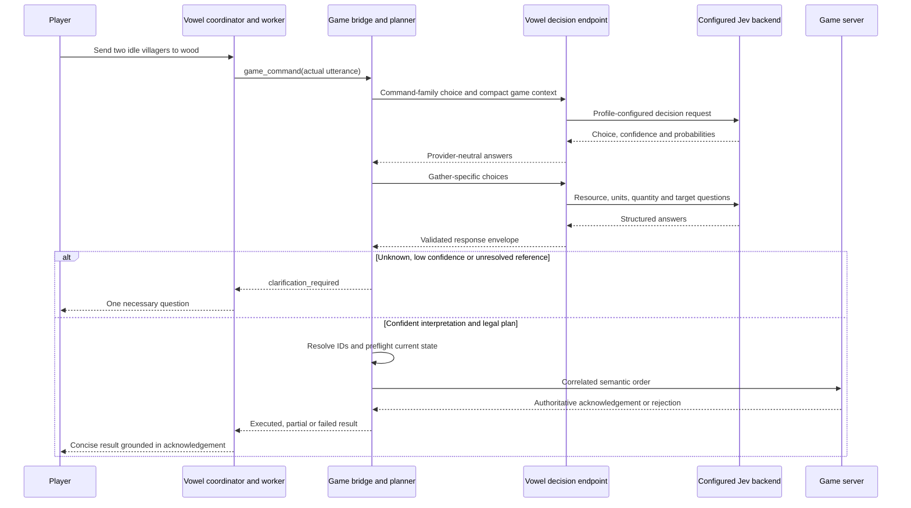
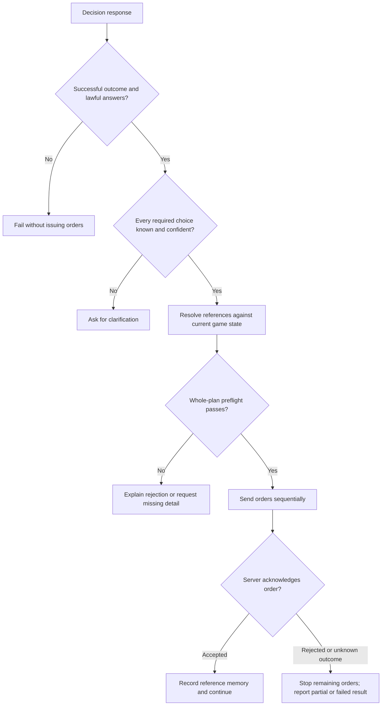

# Jev in Age of AI

Jev is the constrained decision model behind game-command interpretation and
selected announcement-relevance checks. It chooses among options supplied by
the game and returns confidence-bearing answers. It is not the voice assistant,
the strategic chat model, a code generator, or the game authority.

[Vowel](VOWEL.md) owns conversation and exposes the decision endpoint. Age of AI
calls that provider-neutral endpoint; it does not call Cloudflare or Jev directly.
The matching Vowel deployment currently provides a Cloudflare Workers AI adapter
whose default model is `typesafe/jev`.

## Where it fits



Model interpretation never grants permission. The deterministic planner and
authoritative server remain responsible for ownership, legality, resources,
technology, placement, phase, and execution.

## What the game asks

The planner first chooses a command family, then asks a smaller, family-specific
bundle of questions. The game currently uses the `choice` primitive; Vowel's
general decision API also supports `noul` and `score`, which this planner does
not currently use.

| Family | Narrow choices / resulting actions |
| --- | --- |
| `gather` | Resource, worker reference/role, quantity, source reference |
| `build` | Building type/count, builders, placement reference |
| `move` | Move versus rally point, units, destination |
| `train` | Unit type and quantity |
| `research` | Technology ID or advance age |
| `combat` | Attack, repair, stop, garrison, unload; units and target |
| `economy` | Buy/sell resource lots, cancel queued training, explicit deletion |
| `multi_action` | Route clauses through the normal planner in order |
| `none` | Question, advice, conversation, or no game order |

Each choice question includes `unknown`. The model should select it when the
utterance and context do not safely resolve the choice.

IDs, target selection, resource-source matching, training buildings, and legal
placement are resolved in code. The model does not invent executable programs or
send commands directly. A bounded outline identifies up to five ordered action
slots; each slot then uses the normal family planner. Explicit gather destinations
and build clauses are resolved per slot so a combined request such as “one worker
to berries and one to sheep, then build a mining camp by the gold” does not ask
the model to rediscover names already present in the utterance. The bridge limits
the result to 24 primitive orders. This is not an unrestricted natural-language
program interpreter.

For a bare worker task such as “build a house” or “gather wood,” the planner
deterministically assigns one available idle villager when no worker is named.
A count such as “two villagers” allocates that many idle villagers without asking
for identities. “From farming/food/wood/gold/stone” deliberately retasks workers
from that current job. Explicitly selected villagers are also a deliberate
reassignment and remain eligible while gathering, building, or moving; selection
does not impose an idle requirement.

When a gather resource is named without a particular object, the nearest eligible
visible source is used. Named food sources such as berries, sheep, farms, and fish
remain distinct. Pointing or selecting a resource disambiguates multiple sources
of the same type.

Build placement is similarly deterministic. An omitted location starts at the
assigned villager and searches outward for the nearest legal footprint; the
server moves the villager there and replaces its current task. Every owned
building type can be a relative reference, such as “a house beside the barracks”
or “a mill near the market.” The nearest visible owned building of that type is
chosen relative to the selected tile, pointer, assigned builder, or camera.

## Context and references

[voice-context.ts](client/src/game/voice-context.ts) supplies a semantic view:

- Current phase, age, own resources, population, and technologies.
- Own units/buildings, their orders, production queues, and idle workers.
- Selection, unobstructed map pointer when available, and camera position.
- Bounded nearby resource candidates and currently visible enemy units.
- Game-derived action availability, costs, and reasons actions are unavailable.

The planner adds lightweight conversation memory: the last acknowledged command,
referenced units/building/location, a pending clarification, and the latest
delivered strategy proposal. This supports follow-ups such as “another one,” “do
the same with gold,” or an affirmative response to a currently pending proposal.
References are still checked against current state. A selection or pointer change
during inference causes clarification rather than silently applying the
interpretation elsewhere.

Other players' private resources and technologies are not forwarded. Enemy
information is filtered by visibility. The game does not send a screenshot or
the entire simulation as decision input.

There are practical language limits: clause splitting, numeric coordinate
parsing, and the extra explicit-deletion check currently use English-oriented
patterns. Do not assume every phrasing or language has equivalent support.

## Request and response contract

The browser sends `POST /v1/inference/decisions` to the configured Vowel base URL,
using the existing application key as a bearer token. Browser client keys are
checked against their allowed origin. Provider credentials remain server-side.

This abbreviated request illustrates the contract, not a complete production
command schema or a recorded model response:

```json
{
  "deadlineMs": 8000,
  "state": {
    "currentUtterance": "Send two idle villagers to wood.",
    "recentConversation": [
      {
        "role": "assistant",
        "text": "Game-provided semantic context (data): ..."
      }
    ]
  },
  "questions": {
    "resource": {
      "type": "choice",
      "instructions": "Which resource should be gathered? Choose unknown if unresolved.",
      "criteria": {
        "food": "Food",
        "wood": "Wood",
        "gold": "Gold",
        "stone": "Stone",
        "unknown": "Unresolved or ambiguous"
      }
    }
  }
}
```

The response has `outcome`, `answers`, `backend`, `model`, and `usage`. A choice
answer includes `type: "choice"`, a permitted `choice`, and confidence and/or
choice probabilities. Missing or malformed answers are not executable results.

The client serializes semantic context into bounded state text items because
that is the endpoint's supported wire contract; these are game data, not invented
conversation turns. Context is limited to 32,000 serialized characters, split
into 7,900-character chunks with a data prefix. The endpoint permits 1–16
questions and state text items up to 8,000 characters.

## Confidence and execution safety



The default command threshold is **0.70**, configured at build time with
`VITE_GAME_COMMAND_CONFIDENCE_THRESHOLD` (finite values from 0 to 1).
When both confidence and the selected choice's probability exist, the client
uses their minimum. A high probability cannot hide low confidence. Only choices
required by the selected action must clear the threshold; irrelevant questions
do not authorize or block unrelated actions.

Decision requests ask for an 8-second backend deadline and have an 11-second
browser timeout. The complete command operation has a 90-second cancellation
budget. The game-server acknowledgement timeout is 5 seconds. No automatic retry
is performed for an unknown execution outcome. Cancellation stops unissued work,
not already accepted simulation actions.

The threshold is a safety policy over model scores, not a guarantee of correctness
or a calibrated probability that the action is right. Server validation is still
mandatory even when the model is highly confident.

## Announcement relevance

The same decision client is used by
[announcement-monitor.ts](client/src/game/announcement-monitor.ts) for advisory
categories, resource-shortage alerts, idle-military alerts, and optional strategy
proposals. It asks whether the candidate is useful now or should stay silent,
with current game context, announcement and suggestion preferences, recent
announcements, and conversation-busy state.

Only an `announce` choice with confidence of at least **0.70** proceeds. This
relevance cutoff is currently fixed separately from the configurable command
threshold. Deterministic completion and other simple factual notifications do
not all need a model call.

Strategic wording can then come from Vowel's separate background LLM. Jev does
not write the final speech or control TTS. Candidates are revalidated after
reasoning and again before delivery; a relevance decision is not a reservation
to speak stale state. See [the notification flow](VOWEL.md#proactive-announcements).

Strategy proposals are generated from player-visible state and the selected
resources/military/technology/balanced/none bias. Jev may reject a low-value
proposal, but it does not execute one. After Vowel delivers a proposal, only a
clear affirmative response during its validity window substitutes the stored
command back through the ordinary planner and server-validation path.

## Backend configuration and ownership

Model selection belongs to the separate Vowel deployment:

1. The application key's bound session profile, or the deployment's default
   profile when the key has no bound profile, is resolved.
2. `decision_backend` must be `auto`/unspecified or `cloudflare` in the current
   endpoint implementation.
3. A configured profile `decision_model` wins; otherwise the deployment uses
   `CLOUDFLARE_DECISION_MODEL`, then the adapter default `typesafe/jev`.

The request's optional `model` field does not override that profile selection.
The conversation profile's displayed chat-model name is not evidence of which
decision model ran; inspect the decision response or trace metadata.

Vowel's provider codec maps its neutral decision types to Jev's wire format and
normalizes both direct answer objects and Cloudflare's wrapped `result` envelope.
Those provider details intentionally do not leak into game planning code.

## Source map and diagnostics

| File in this repo | Role |
| --- | --- |
| [client/src/game/voice-decision.ts](client/src/game/voice-decision.ts) | HTTP client, schema checks, confidence policy, cancellation, decision trace |
| [client/src/game/voice-planner.ts](client/src/game/voice-planner.ts) | Family/narrow questions, references, deterministic commands |
| [client/src/game/voice-context.ts](client/src/game/voice-context.ts) | Semantic state and affordances |
| [client/src/game/voice-bridge.ts](client/src/game/voice-bridge.ts) | Plan preflight and acknowledged execution |
| [client/src/net.ts](client/src/net.ts) | Request correlation and acknowledgement timeout |
| [shared/src/command-validation.ts](shared/src/command-validation.ts) | Runtime command-shape validation |
| [server/src/game/room.ts](server/src/game/room.ts) | Authoritative command processing |

Relevant paths in the separate Vowel repo:

- `apps/worker/src/services/decision-inference.ts`: authentication, origin and
  profile resolution, request validation, provider invocation.
- `packages/providers/src/decision/CloudflareDecisionModel.ts`: configured
  Workers AI adapter.
- `packages/providers/src/decision/JevWireCodec.ts`: wire encoding and decoding.
- `packages/decision-model/src/`: provider-neutral decision types and errors.

Inspect `game.command.decision.result` for backend/model, usage, latency,
answers, and minimum confidence; inspect `game.command.clarification`,
`game.command.failed`, and `game.command.result` for the downstream outcome.
Relevance calls share the decision-client trace labels, so inspect the question
names (for example `relevance`) rather than assuming every decision is a command.

If interpretation fails, check the configured key/origin, profile, decision
backend/model, Workers AI binding, response shape, and deadline before changing
the confidence threshold. Successful inference alone does not prove execution:
verify the server acknowledgement and live game state. Follow the manual-only
verification policy described in [VOWEL.md](VOWEL.md#source-map-and-verification).
