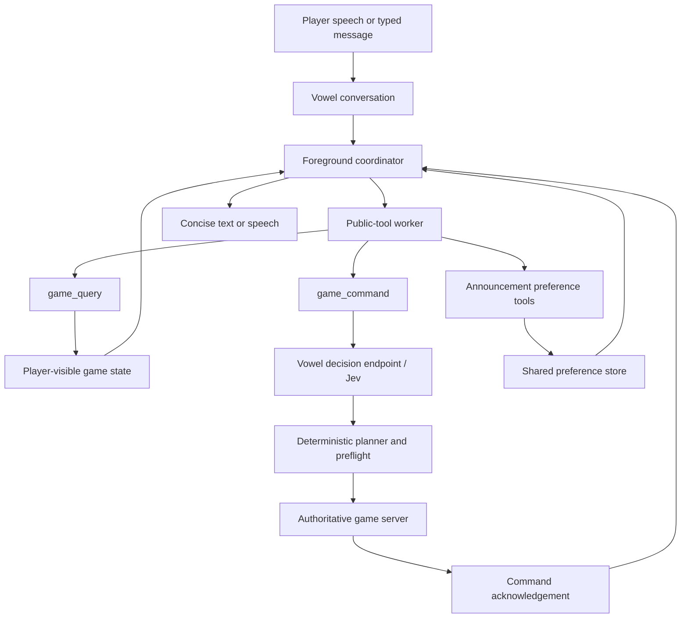
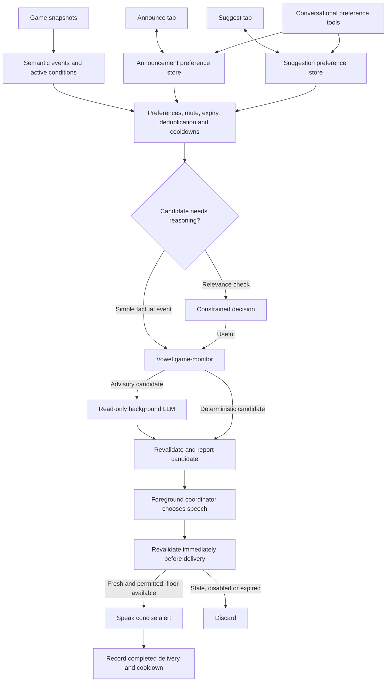

# Vowel in Age of AI

Vowel is the game's conversational interface. It handles speech input, typed
messages, conversation coordination, tool calls, interruption, and spoken
responses. It does not own the simulation or decide whether a game order is legal.

For the constrained decision model used behind game commands, see [JEV.md](JEV.md).
The original feature requirements are in the
[conversational gameplay specification](.agents/specs/age-of-ai-vowel-conversational-gameplay-spec.md).

## Responsibilities and architecture

| Component | Responsibility |
| --- | --- |
| Embedded Vowel popover | Microphone, typed input, conversation UI, playback, telemetry |
| Vowel foreground coordinator | Route requests, delegate tool work, choose whether and when to speak |
| Vowel decision endpoint / Jev | Return constrained, confidence-bearing interpretations |
| Game planner and bridge | Resolve references, construct orders, preflight the plan |
| Authoritative game server | Validate and execute orders; return correlated acknowledgements |
| Game monitor | Observe semantic events and propose useful announcements |
| Announcement preference store | Share player policy between settings and conversational tools |
| Suggestion preference store | Gate optional proposals and apply the selected strategy bias |

There is one conversational runtime, not a second game-specific microphone or
speech engine. Game control uses semantic tools, not clicks on rendered controls.
Core game modules do not import the Vowel UI package; Vowel-specific wiring stays
at the integration boundary.

## Connecting and using it

1. Open **Options → Vowel** and enter the Vowel URL and application API key.
2. Prefer an origin-authorized client key bound to the intended session profile.
   The configured origin must match the game's origin.
3. Join a match, then use the Vowel bar to type or start a voice conversation.
4. Use **Options → Announce** to control proactive notifications and
   **Options → Suggest** to enable and bias optional strategy proposals.

On this development machine, the game is at `https://age-of-ai.localhost` and
the Vowel service is at `https://vowel.localhost`. Follow [AGENTS.md](AGENTS.md)
for the canonical development services; do not start duplicate servers.

The connection is stored in this browser tab's session storage. A separate
browser or tab can have a different connection. Provider credentials stay on the
Vowel server; never put model-provider keys in game code or commit application keys.

The backend needs working providers, applicable billing, and a session profile
that supports the requested capabilities. Proactive announcements require the
matching Vowel backend with the registered `game-monitor` agent and a
background-coordinator profile. A successful connection is not proof that every
provider or end-to-end audio path works.

### Example requests

| Request | Path |
| --- | --- |
| “How much wood do I have?” | Read-only `game_query` |
| “Send two idle villagers to wood.” | `game_command`, decisions, planner, server |
| “Take two villagers from farming and move them to sheep.” | Role-based worker reassignment |
| “Use the selected villagers to build two houses.” | Reassign selected workers even when busy |
| “Train another one.” | Command using the last acknowledged order as context |
| “Build a house near the town center.” | Command with deterministic legal placement |
| “Build a mill beside the market.” | Relative placement using a visible owned building |
| “Build a house.” | Place near the assigned builder at the nearest legal footprint |
| “Should I age up?” | Query-backed advice; not permission to advance |
| “Tell me when I have at least three idle villagers.” | Save an announcement preference |
| “Favor military suggestions.” | Update suggestion preferences |
| “Yes.” after a delivered proposal | Confirm its stored command through `game_command` |
| “Quiet for fifteen minutes.” | Temporarily mute announcements |

Selection, pointer location, worker roles, previous references, resource types,
and visible owned building types help resolve orders. Selected workers are
explicitly reassignable even when busy. Unnamed workers come from the idle pool;
named source jobs deliberately retask busy workers. New speech cancels unissued
work; it cannot undo an order the server already accepted. Multiple orders
execute sequentially, not as an atomic transaction. An acknowledgement means an
order started or was queued, not that construction, movement, or training has
finished.

## Tool boundary

| Tool | Purpose |
| --- | --- |
| `game_query` | Read resources, selection, idle units, army, buildings, age, research, available actions, or overview |
| `game_command` | Interpret the actual player request and return acknowledged execution, rejection, partial result, or clarification |
| `game_get_announcement_preferences` | Read the shared settings |
| `game_set_announcement_preference` | Update one category, threshold, or supported advisor frequency |
| `game_mute_announcements` | Mute temporarily, mute until unmuted, or unmute |
| `game_get_suggestion_preferences` | Read the Suggest-tab master toggle and strategy bias |
| `game_set_suggestion_preferences` | Enable/disable proposals or select resources, military, technology, balanced, or no weighting |
| `game_monitor_next` | Reserved long-poll event source for the registered monitor |
| `game_monitor_validate` | Reserved candidate validation and delivery receipt |

Ordinary background LLM workers are excluded from the two reserved monitor
tools. Strategic analysis receives no game-mutation tools.

## Proactive announcements

The browser derives semantic events from game snapshots, independently of
rendering and voice connectivity. The Vowel backend runs one session-long
observer that consumes eligible candidates. It reports facts to the foreground
coordinator; it never invokes TTS itself.

Categories cover building/research completion, age availability, idle villagers,
population pressure, resource shortage/surplus, enemies spotted, damage,
idle military, strategic opportunities, economy advice, production advice, and
optional strategy proposals.

Important policy details:

- **Active now** lists current conditions, including disabled categories. It is
  not a speech queue or a promise to announce each item.
- State warnings use hysteresis. For example, an idle-villager episode does not
  repeat on every count change; its latch resets when no villagers remain idle.
- Candidates expire. A queued idle count is discarded if the count changes or
  the condition clears before delivery.
- Advisory categories can be reconsidered, subject to relevance, recent history,
  and cooldowns. Advisor frequency scales the cooldown, not a promised schedule.
- Mute supports 5 minutes, 15 minutes, until unmuted, and unmute. Urgent
  under-attack warnings bypass mute only when the override is enabled.
- Settings persist locally under the game client identity, behind a replaceable
  persistence interface. There is no cross-account synchronization.

## Strategy suggestions

Strategy suggestions are off by default and have a dedicated **Suggest** tab.
The master toggle is authoritative. Bias can favor resources, military, or
technology; balanced raises whichever area is falling behind; none applies no
extra weighting. Bias does not itself enable suggestions.

The browser constructs concrete candidates only from player-visible state and
currently legal affordances—for example training villagers, placing a drop-off
building beside a visible resource, creating military production, researching,
or advancing age. The normal notification relevance, cooldown, conversation
floor, and delivery revalidation still apply. Vowel phrases a delivered proposal
as one brief optional “Want me to…?” question and does not combine it with an
unrelated alert.

A proposal never mutates the game by itself. The bridge retains the most recently
delivered proposal for a short confirmation window. A clear affirmative reply is
passed verbatim to `game_command`, resolved to that stored proposal, and then goes
through the ordinary planner, preflight, authoritative server validation, and
acknowledgement path. A negative reply discards it, and an expired proposal is no
longer resolvable. Any intervening state change is caught by the normal command
validation path rather than bypassed.

### Typed turns versus voice sessions

Typed requests open short-lived text sessions. They can query, execute commands,
and save notification preferences, but do **not** start the persistent monitor.
The registered monitor starts for an eligible audio session with its tools
available and is cancelled with that session. Disconnecting Vowel does not stop
ordinary gameplay. Leaving a match disposes its bridge and condition state.

“Tell me when…” is a preference change, not a request to start a generic polling
worker. The monitor owns future detection; the conversational worker saves the
preference and finishes.

## Response and notification style

Game instructions request one short sentence, normally 5–15 words. Routine
alerts target at most 12 words. These are model instructions, not a hard text
truncation mechanism.

Prefer “Two villagers gathering wood” or “Idle alerts on for two villagers.”
Skip greetings, “On it” preambles, repeated confirmations, and “still watching”
updates. Stay silent while a routine tool runs, then give one grounded result.
Ask one necessary clarification and wait. Expand only when the player asks for
details or a failure needs explanation.

## Failures and diagnostics

- Decision failure or insufficient confidence: do not guess or issue an order.
- Command acknowledgement timeout/disconnect: outcome may be unknown; do not
  automatically retry and risk duplicate orders.
- Background analysis failure: skip strategic advice; deterministic events can
  still proceed when the session and event source are healthy.
- Preference storage failure: expose a warning; changes can be session-only.
- Missing notifications: check voice mode, profile/background support, enabled
  category, threshold, mute, active condition, expiry, and conversational floor.

The existing trace includes labels such as `game.command.decision.result`,
`game.command.result`, `game.preference.updated`,
`game.notification.suppressed`, `game.notification.revalidated`, and
`game.notification.delivered`. Suppression reasons distinguish disabled, muted,
cooldown, duplicate, expired, cleared, low-relevance, superseded, busy, and
coordinator-silent candidates. Text acknowledgement is not evidence of an actual
game mutation: compare it with server results and live game/UI state.

## Source map and verification

| File | Role |
| --- | --- |
| [client/src/vowel.tsx](client/src/vowel.tsx) | Connection, profile metadata, embedded overlay |
| [client/src/game/vowel-game-api.ts](client/src/game/vowel-game-api.ts) | Tools, instructions, lifecycle and telemetry boundary |
| [client/src/game/voice-bridge.ts](client/src/game/voice-bridge.ts) | Match-scoped queries, plan validation, execution and interruption |
| [client/src/game/voice-planner.ts](client/src/game/voice-planner.ts) | Decision questions, deterministic references and command plans |
| [client/src/game/voice-context.ts](client/src/game/voice-context.ts) | Player-visible facts and available actions |
| [client/src/game/announcement-monitor.ts](client/src/game/announcement-monitor.ts) | Semantic events, candidate policy and revalidation |
| [client/src/game/announcements.ts](client/src/game/announcements.ts) | Preferences, persistence and active conditions |
| [client/src/screens/announcements.ts](client/src/screens/announcements.ts) | Announcements settings UI |
| [client/src/game/suggestions.ts](client/src/game/suggestions.ts) | Suggestion toggle/bias persistence |
| [client/src/screens/suggestions.ts](client/src/screens/suggestions.ts) | Suggest settings UI |
| [packages/vowel-popover/src/voice-panel.tsx](packages/vowel-popover/src/voice-panel.tsx) | Typed-turn sessions |
| [packages/vowel-popover/src/vowel-adapter.ts](packages/vowel-popover/src/vowel-adapter.ts) | Audio-session adapter |

The matching backend lives in the separate Vowel repository, not this repo.
Relevant paths there are `packages/runtime/src/game-monitor-agent.ts`,
`background-worker.ts`, `background-coordinator.ts`, and `llm-background-agent.ts`.

Use code inspection, `npm run typecheck`, `npm run build`, and direct manual
application use. The implementation specification prohibits creating or running
automated tests unless explicitly authorized. Manual verification has confirmed
typed factual queries, a gathering order reflected in the simulation, ambiguous
command clarification, and preference/UI synchronization with a concise response.
That does not establish microphone/STT/TTS or proactive spoken-delivery acceptance;
verify those separately with voice mode enabled.
